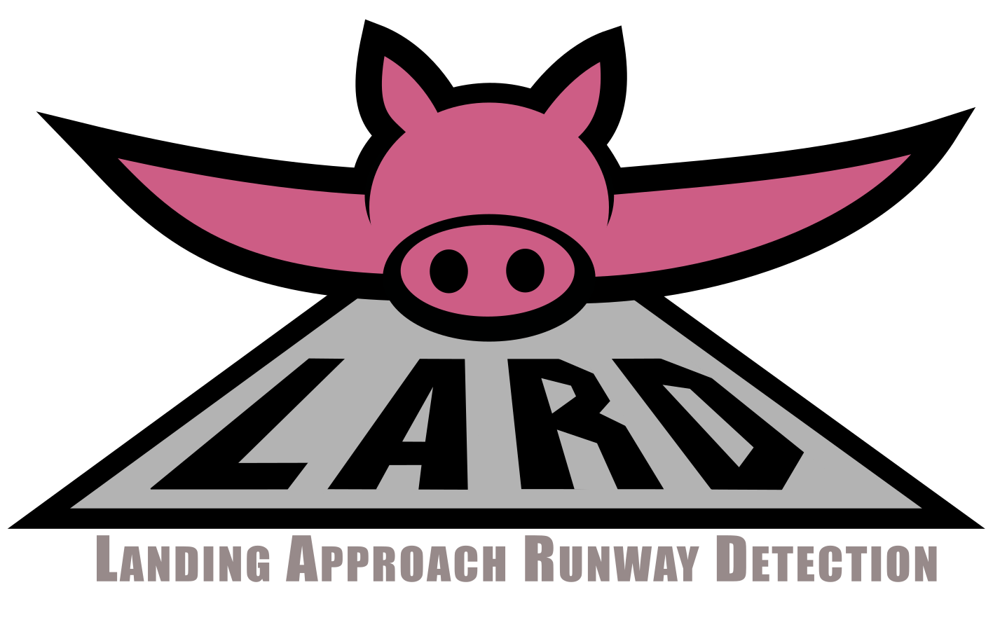
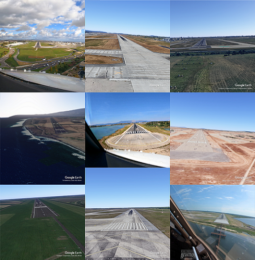
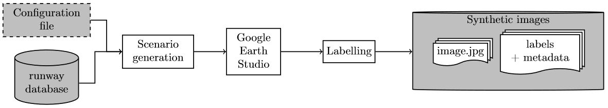
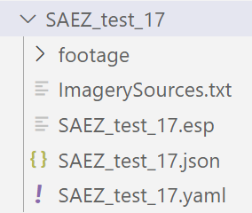
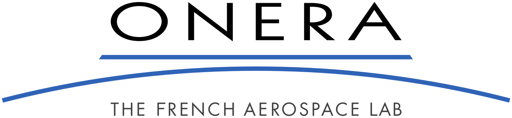
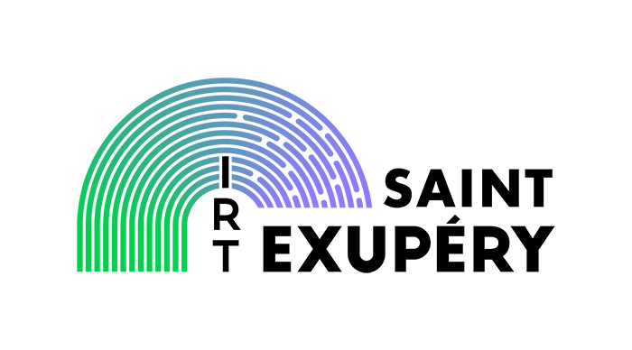

<br>
<div align="center">
    
</div>
<!-- Badge section -->
<!--<div align="center">
    <a href="#">
        
    </a>
    <a href="#">
        
    </a>
</div>-->
<br>


Landing Approach Runway Detection (**LARD**) is a [dataset](#%EF%B8%8F-lard-dataset) of aerial front view images of runways designed for aircraft landing phase. It contains over 17K synthetic images of various runways, enriched with more than 1800 annotated pictures from real landing footages for comparison.

We also provide a [synthetic image generator](#%EF%B8%8F-synthetic-generator) based on Google Earth Studio if you want to enrich your dataset, or *fatten your LARD*. Starting from a database of runway positions, our generator produces high quality synthetic pictures of airport runways with their metadata. Through geometric transformations, these pictures can then be automatically annotated with the position of the runway or any targeted element in the aerial picture.

|  |  |
:---:|:---:
*Synthetic and real runways* | *Synthetic landing sequence*


## 🚀 Quickstart
- 💾 [Download LARD dataset](https://share.deel.ai/s/H4iLKRmLkdBWqSt?path=%2Flard%2F1.0.0)
- 🔥 [Generate scenarios (notebook)](01_scenario_generation.ipynb)
- 🛠️ [Export tool (notebook)](export_tool.ipynb)
- 📜 [Read paper](https://hal.science/hal-04056760)

# 📚 Table of contents

- [✈️ LARD dataset](#%EF%B8%8F-lard-dataset)
- [⚙️ Synthetic generator](#%EF%B8%8F-synthetic-generator)
  1. [Enrich the runway database](#1-enrich-the-runway-database)
  2. [Generate scenarios](#2-generate-a-scenario)
  3. [Label automatically](#3-automatic-labeling)
- [🛠️ Dataset exploitation](#%EF%B8%8F-dataset-exploitation)
- [👀 See Also](#-see-also)
- [🎓 Authors](#-authors)
- [🗞️ Citation](#%EF%B8%8F-citation)
- [📝 License](#-license)

# ✈️ LARD Dataset

- 💾 [LARD - **Download**](https://share.deel.ai/s/H4iLKRmLkdBWqSt?path=%2Flard%2F1.0.0)

***[New 08/2023]*** _Over 1700 images were annotated and added to the test set of real images_

This dataset is dedicated to the detection of a runway from an aircraft during approach and landing phases. Therefore the majority of images in this dataset were generated using conventional landing trajectories: the set of possible positions and orientation of the aircraft during landing was defined as a *generic landing approach cone* which corresponds to the following ranges of parameters:

|Parameter name|value ranges|
|-|-|
| Distance             | [0.08, 3] NM |
| Vertical deviation   | [2.2°, 3.8]° | 
| Lateral deviation    | [-4, 4]°     |
| Yaw                  | [-10,10]°    |
| Pitch                | [-8,0]°      |
| Roll                 | [-10,10]°    |

The first 3 parameters correspond to the position of the aircraft relative to the runway, while the last 3 parameters correspond to its orientation.

### 📁 Dataset structure
As of today, the dataset contains around 17K images in total, divided into the following main folders:
```
LARD_test_real/
LARD_test_synth/
LARD_train.csv
LARD_train_BIRK_LFST/
LARD_train_DAAG_DIAP/
LARD_train_domain_adaptation/
LARD_train_KMSY/
LARD_train_LFMP_LFPO/
LARD_train_LFQQ/
LARD_train_LPPT_SRLI/
LARD_train_VABB/
```
- All `LARD_train_*` folders contain images dedicated to training, from one or more airports
- The `LARD_test_real` folder is dedicated to testing models on real images, and is further divided into 3 subfolders with _nominal_cases_, _edge_case_ with a poor runway visibility, and _domain_adaptation_ 
- The `LARD_test_synth` folder is  dedicated to testing models on synthetic images
- The metadata are provided in a single file in each folder or subfolder, and the metadata of the whole set of training images is also provided as a single file at the root of the folder (`LARD_train.csv`)

💡 _Note that this dataset may be updated in the future, with more images for new runways and a greater variety of sources, for both the train set and the test set (and possibly other sets)_

### 🏷️ Metadata
The images of the dataset are provided in a `images/` folder together
with a `.csv` file which contains all the metadata. Some metadata are
not always available for both real and synthetic images, but the
following columns are common:

-   First, a few general information about the pictures are provided,
    such as the relative `path` of the picture or its `width` and `height`. _It is worth noting that the synthetic images all come in the same 2448×2648 resolution, while the pictures from real footage are in majority 3840×2160 or 1920×1080 resolutions._

-   Then, data about the origin of the picture are given, such as the
    `initial scenario` which generated the image, or the `type` of data,
    which is either *real* or *earth_studio* for now, but could be
    completed with other sources such as flight simulators.

-   The next columns indicate the `airport` and `runway` targeted during
    landing, when they are known. _Note that the runway is not a number but an identifier which may contain a letter (L/C/R for
    Left/Center/Right)._
-   Finally, the last columns provide the pixel coordinates of each
    `corner` of the runway on the picture.

Due to limitations, the remaining columns are specific to only one source of data, but could also be used jointly by a new source of data such as a flight simulator supporting live weather.

For real images, three additional metadata are provided:

- `weather`, which primarily indicates that the runway visibility is reduced due to the presence of rain, on the windscreen or in the sky.

- `night`, a boolean value which is true if the image was taken during night time, and by extension if the runway lights are on.

- `time to landing`, a duration in seconds before reaching the aiming point, retrieved from the initial video footage.

For synthetic images, weather is not provided, and the night view is simulated with a simple reduction of ambient brightness, which produces far from realistic images since the runway lights stay unlit. The `time to landing` is also unknown, however in contrast to real images, the position of the camera relative to the runway is defined in the initial scenario and can be used to compute relevant data about the aircraft position, namely the `slant distance`, the `along track distance`, the `height above runway`, the `lateral path angle` and the `vertical path angle`. These values represent the relative position of the aircraft with respect to specific points on the runway.

Please refer to the `infos.md` file for a detailed description of each metadata.

<!--- Quelques stats? + aeroports du dataset
  - Distrib ratios taille des boites
    - Echelle de distance 3eme dim (couleur)
  - Positions des centres
  - 
  - (video cone) -->

### 🎥 Real footage
<div align="right">
  <picture>
    <a href="http://www.youtube.com/watch?v=17MUtbOfdNQ?t=500s"></a>
  </picture>
</div>

The following channels were used to build the set of real images of LARD. These content creators provided the rights to use their footage videos for research and for the sole purpose of building this open-source dataset, and their videos can be used to obtain more images of runways, which must then be manually annotated:

- [The Great Flyer](https://www.youtube.com/user/TheGreatFlyer/search?query=landing)
- [D.N.Hug](https://www.youtube.com/c/dnhug/search?query=landing)
- [High Pressure Aviation Films](https://www.youtube.com/c/HighPressureAviationFilms/search?query=landing)
- [SOG Pilot](https://www.youtube.com/@sogpilot3137/search?query=landing)
- [737 Aviation](https://www.youtube.com/@737Aviation/search?query=landing)
- [InZeAir84](https://www.youtube.com/@INZEAIR84/search?query=landing)

<!--
[](http://www.youtube.com/watch?v=17MUtbOfdNQ?t=500s "Landing at PALERMO, by GreatFlyer")-->


# ⚙️ Synthetic Generator
The simplified internal working of the generator is as follows:
<div align="center">
    
</div>
<br>

### ⚡️ *In short:*
1) 🔥 [Update runways database (notebook)](00_database_generation.ipynb): You can enrich the runway database used as input with new airports and runways.
2) 🔥 [Generate scenarios (notebook)](01_scenario_generation.ipynb): We offer the capability to generate highly configurable landing scenarios
3) 🔥 [Label automatically (notebook)](02_labeling.ipynb): We provide the tool to automatically annotate the resulting images

## 🔌 Setup
- **`pip`** install: You can use the `requirements.txt` to install packages through:
```
pip install -r requirements.txt
```

## 1. Enrich the runway database
- 🔥 [Notebook - **Database generation**](00_database_generation.ipynb)
  - This notebook provides a comprehensive example for adding or update runways and airports in the database.
- The database used for LARD is provided in [`data/runways_database.json`](data/runways_database.json)
- The database is a simple json file which contains the position of each corner in both `lat/lon/alt` coordinates and the corresponding ECEF (Earth-centered Earth-fixed) coordinates (A,B,C and D are the corners names):
  
``` 
    "AIRPORT": {
      "RUNWAY": {
        "A": {
            "position": {
                "x": -2183272.4689240726,
                "y": 4357496.814901311,
                "z": 4103132.159236785
            },
            "coordinate": {
                "latitude": 40.09288445386455,
                "longitude": 116.61262013286958,
                "altitude": 30.0
            }
        ...
```

_Note that only the WGS84 coordinates (`lat/lon/alt`) are needed, as the ECEF coordinates are automatically computed by the script._

## 2. Generate a scenario
- 🔥 [Notebook - **Scenario generation**](01_scenario_generation.ipynb)
  - This notebook provides a comprehensive example for generating a scenario for a specific runway.
- 🖳 **CLI** - Alternately, you can generate news scenarios in command line :
  1. Configure your scenario as a `.yml` file. An example is provided in [`params/example_generation.yml`](params/example_generation.yml)
  2. Run the script with the `.yml` as an input:
```
python src/scenario/write_scenario.py params/example_generation.yml
```
The correspondance between parameter names and names used in the code are as follows:
|Usual name|parameter name
|-|-|
| Distance           | `min_distance_m`, `max_distance_m`  |
| Vertical deviation / Glide slope angle | `alpha_v_deg`, `std_alpha_v_deg` | 
| Lateral deviation  | `alpha_h_deg`, `std_alpha_h_deg`|
| Yaw                | `yaw_deg`, `std_yaw_deg`  |
| Pitch              | `pitch_deg`, `std_pitch_deg` |
| Roll               | `roll_deg`, `std_roll_deg` |

However all these parameters except the distance are not defined as ranges, but rather with gaussian noise around a fixed center and a standard deviation (`std_***`).

This scenario generation will produce both a `.esp` file and a `.yaml` file. The first one is needed for Google Earth Studio, while the second one is needed for the labeling process.

## 2-bis Google Earth generation recommendations
The `.esp` file produced at *step #2* can be directly loaded into Google Earth Studio. User can then verify the image sequence, especially to treat any problem relative to time of day in case of night images, which may require a new scenario generation, or potential occlusions. Then the sequence of images can be rendered by the tool, with the following recommendations:
- The image size should not be changed
- The attribution should be placed as far as possible in the corner at the bottom of the image
- In *'advanced'* settings, The `.json` file for 3D data must be generated with a 'global' coordinate space

<div align="right">
    
</div>
<br>

❗️ **Important:** This generation will create a folder, in which the `.yaml` file produced at step #2 must be copied or moved, to obtain a directory organized like the example on the right.

## 3. Automatic labeling
- 🔥 [Notebook - **Labeling**](02_labeling.ipynb)
  - This notebook provides a comprehensive example to automatically label one or multiple Earth Studio generation results and export the corresponding dataset.
- 🖳 **CLI** - Alternately, you can generate news scenarios in command line :
  1. Configure your scenario as a `.yml` file. An example is provided in [`params/export_train_dataset.yml`](params/export_train_dataset.yml)
  2. Run the script with the `.yml` as an input:
```
python src/labeling/generate_dataset.py params/export_train_dataset.yml
```


# 🛠️ Dataset Exploitation
- 🔥 [Notebook - **Export tool**](export_tool.ipynb)
  - This notebook provides a comprehensive example to export the dataset in a specific format such as COCO.
- This tool allows to generate `bounding boxes` around the corners of the runway, in several possible format, to choose between `multiple` label files or a `single` label file, and to `crop` the watermark.
- The dataset before export should respect a specific structure which is detailed in the notebook, and looks like this:
```
    DATASET_PATH/
    | metadata.csv
    | images/
    | | nameimage1.jpeg
    | | nameimage2.jpeg
    | | ...
```

- 🖳 **CLI** - Alternately, you can export a dataset in command line:
```
python src/dataset/lard_export.py --train data/multiple_train --test data/test_dataset -o data/converted_coco -b "xywh" -n -lf "multiple" -c -s " "
```

Please refer to the provided [notebook (export tool)](export_tool.ipynb) for comprehensive details about the possible export options and the folder structures.

## Documentation

Technical Documentation
The technical documentation of the different python modules and python methods implemented can be found in "./doc/build". You can open "./doc/build/index.html" in a web browser to navigate through it.

## 👀 See Also

More from the DEEL project:
- [Xplique](https://github.com/deel-ai/xplique) a Python library exclusively dedicated to explaining neural networks.
- [deel-lip](https://github.com/deel-ai/deel-lip) a Python library for training k-Lipschitz neural networks on TF.
- [Influenciae](https://github.com/deel-ai/influenciae) Python toolkit dedicated to computing influence values for the discovery of potentially problematic samples in a dataset.
- [PUNCC](https://github.com/deel-ai/puncc) Puncc (Predictive uncertainty calibration and conformalization) is an open-source Python library that integrates a collection of state-of-the-art conformal prediction algorithms and related techniques for regression and classification problems
- [OODEEL](https://github.com/deel-ai/oodeel) OODeel is a library that performs post-hoc deep OOD detection on already trained neural network image classifiers. The philosophy of the library is to favor quality over quantity and to foster easy adoption
- [deel-torchlip](https://github.com/deel-ai/deel-torchlip) a Python library for training k-Lipschitz neural networks on PyTorch.
- [DEEL White paper](https://arxiv.org/abs/2103.10529) a summary of the DEEL team on the challenges of certifiable AI and the role of data quality, representativity and explainability for this purpose.

## 🎓 Authors

<div align="center">
    <a href="#">
        
    </a>&nbsp;&nbsp;
    <a href="#">
        
    </a>&nbsp;&nbsp;
    <a href="#">
        
    </a>&nbsp;&nbsp;
    <a href="#">
        
    </a>
    <a href="#">
        
    </a>
</div>
This project is a joint research work from ONERA, IRT Saint Exupéry and AIRBUS. It received funding from the French ”Investing for the Future – PIA3” program within the Artificial and Natural Intelligence Toulouse Institute (ANITI).

## 🗞️ Citation
You can read our paper at https://hal.science/hal-04056760.

If you use LARD as part of your workflow in a scientific publication, please consider citing the following paper:
```
@unpublished{ducoffe:hal-04056760,
  TITLE = {{LARD - Landing Approach Runway Detection - Dataset for Vision Based Landing}},
  AUTHOR = {Ducoffe, M{\'e}lanie and Carrere, Maxime and F{\'e}liers, L{\'e}o and Gauffriau, Adrien and Mussot, Vincent and Pagetti, Claire and Sammour, Thierry},
  URL = {https://hal.science/hal-04056760},
  NOTE = {working paper or preprint},
  YEAR = {2023},
  MONTH = Apr,
  KEYWORDS = {open-source dataset ; vision based landing ; ML},
  PDF = {https://hal.science/hal-04056760/file/main.pdf},
  HAL_ID = {hal-04056760},
  HAL_VERSION = {v1},
}
```

## 📝 License
The package is released under [MIT license](LICENSE).
