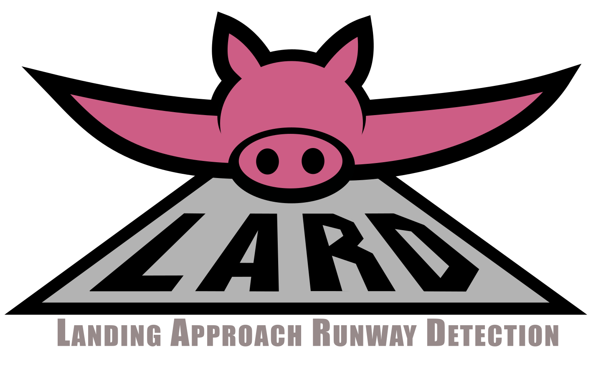
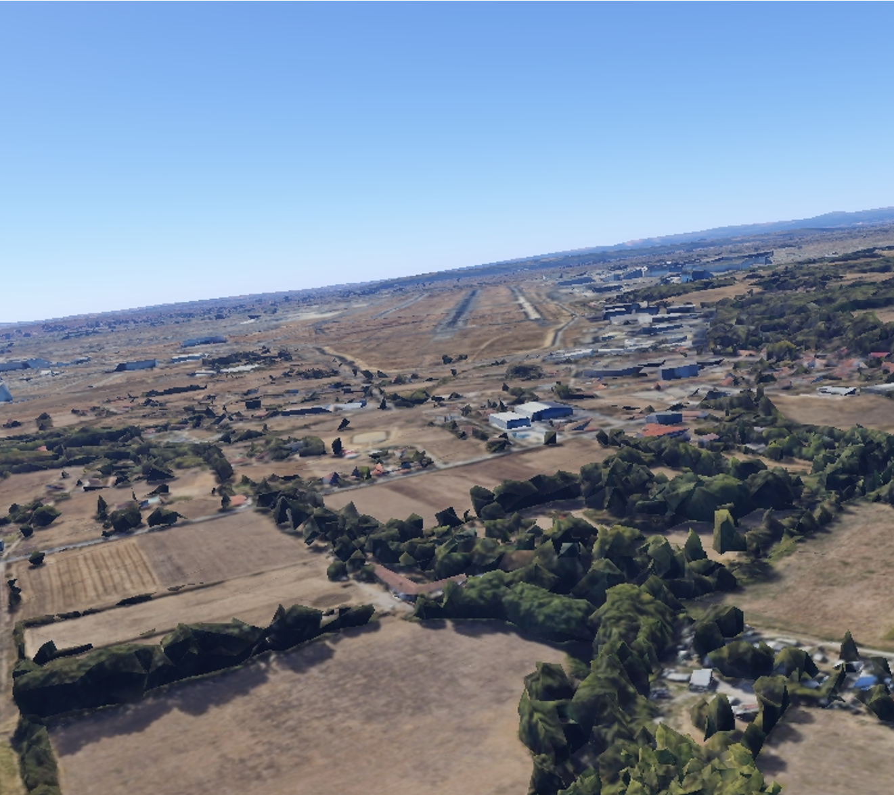
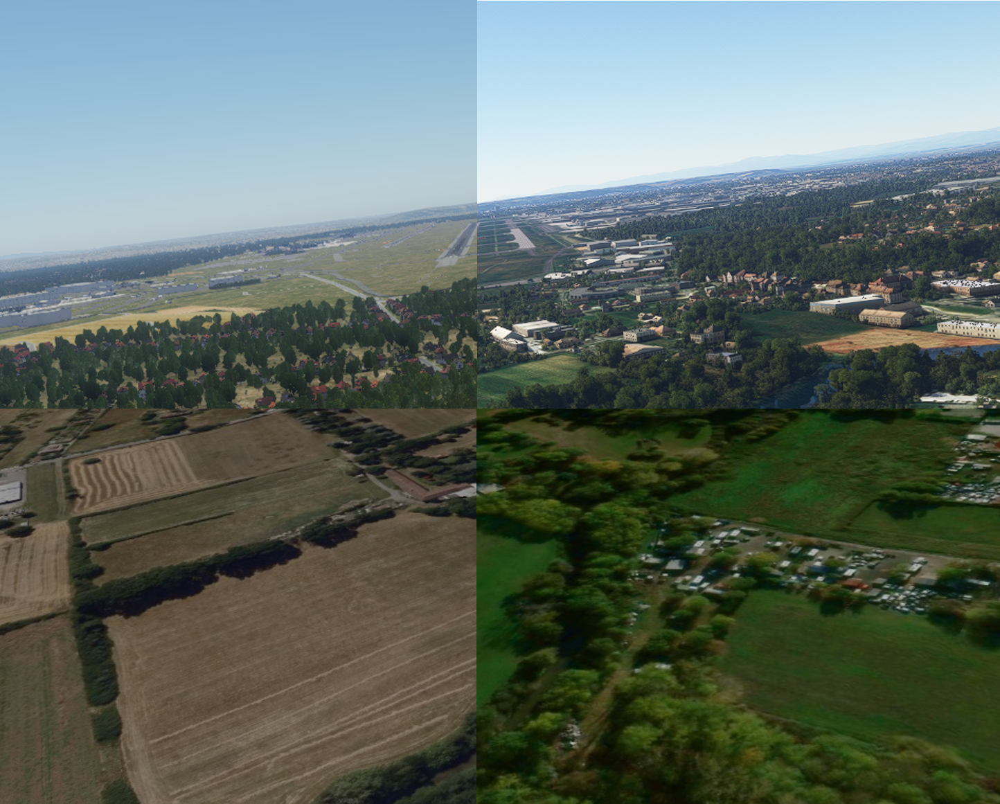
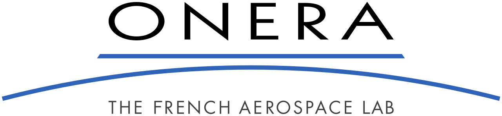
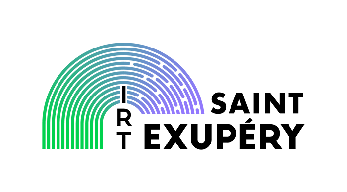

<br>
<div align="center">
    
</div>
<!-- Badge section -->
<!--<div align="center">
    <a href="#">
        
    </a>
    <a href="#">
        
    </a>
</div>-->
<br>

> This page presents **LARD V2**, the **second** version of our dataset and generator. **LARD V1** can be found [here](https://github.com/deel-ai/LARD/tree/LARD_V1).

Landing Approach Runway Detection (**LARD**) is a [dataset](#lard-v2-dataset) of aerial front view images of runways designed for aircraft landing phase. This second version contains over **100 000** synthetic images of runways from the **~250** airports with the most traffic worldwide.

LARD is also a synthetic image generator which allows to generate images from 5 different data sources: Google Earth, Bing Maps, ArcGIS, XPlane and Flight Simulator. In this second version of LARD, we provide an interface for generating landing scenarios based on Streamlit.

|  |  |
:---:|:---:
***LARD V1*** | *Additional data sources in **LARD V2***
***Google Earth*** | *(Top) left: **XPlane**, right: **Flight Simulator***
| | *(Bottom) left: **Bing Maps**, right: **ArcGIS***


## Quickstart
- [Download LARD **V2** dataset](https://huggingface.co/datasets/DEEL-AI/LARD_V2)
- [Launch Streamlit Application](#streamlit-interface)
- [Read our paper](https://arxiv.org/pdf/2603.26748)

# Table of contents

- [Streamlit Interface](#streamlit-interface)
- [LARD V2 dataset](#lard-v2-dataset)
- [Image Generation Recommendations](#image-generation-recommendations)
- [Models](#models)
- [See Also](#see-also)
- [Authors](#authors)
- [Citation](#citation)
- [License](#license)


# Streamlit Interface

LARD V2 now provides a user interface to simplify the generation of new data, based on [Streamlit](https://streamlit.io/). 

### Setup

- **`pip`** install: We recommend using the `requirements.txt` to install packages in your environment with:
```
pip install -r requirements.txt
```

### Run

You can run the Streamlit interface with:
```
streamlit run ./Home_page.py
```
This will open a new window in your browser, which will guide you through the process of generating new scenarios. This interface provides the same functionalities as the usual notebooks 01_scenario_generation.ipynb and 02_labeling.ipynb, but in a more convenient way.


> If needed, these notebooks are still available if needed, please refer to the [section 2 of the LARD V1 Readme](https://github.com/deel-ai/LARD/tree/LARD_V1/?tab=readme-ov-file#%EF%B8%8F-synthetic-generator) for more details.


# LARD V2 Dataset

- [LARD **V2** - **Download**](https://share.deel.ai/s/H4iLKRmLkdBWqSt?path=%2Flard%2F1.0.0)

This dataset is dedicated to the detection of a runway from an aircraft during approach and landing phases. In our work, we only consider the approach segment which ranges from -6000 m to -280 m along-track distance from Landing Threshold Point (LTP). Throughout this segment, the acceptable aircraft positions remain similar but not equivalent to the ODD of LARD V1: the lateral path angle lies within [-3°,3°], originating from the LTP, while the vertical path angle takes its values in [-1.8°,-5.2°] w.r.t. the Vertical Reference Point (VRP), a point on the centerline located 305 m beyond the LTP.

For the aircraft attitude, the range for the pitch stays constant, between [-15°, +5°], which translates to an average nose-down orientation of about 5° relative to the horizon. 
This value is relative to the horizontal, meaning we can use [90 -pitch] to obtain the raw value. However, to define appropriate ranges for the aircraft roll and yaw, the approach cone is split into 3 segments as follows:

|Along track distance (m) | Yaw range (°)| Roll range (°)|
|-|-|-|
| [-6000, -4500] | [-24, 24]     | [-30, 30]|
| [-4500, -2500] | [-24, 24]     | [-15, 15]|
| [-2500, -280]  | [-18.5, 18.5] | [-10, 10]|

In term of image characteristics, we generated 1024x1024 images in jpeg format for LARD V2, with a fov of 60 (Please note that this is different from LARD V1 which was 2048x2448 with a fov of 30).

### Dataset structure

The dataset available on [HugginFace](https://huggingface.co/datasets/DEEL-AI/LARD_V2) is structured as follows:

A folder `images` contains all images from LARD V2. It is further partitioned by data sources, which in turn contain one folder for each airport:
```
    images/
    | arcgis/
    | | CYEG/
    | | | CYEG-2-20-12-30__10-smpl__10h40_000_ArcGIS.jpg
    | | | CYEG-2-20-12-30__10-smpl__10h40_001_ArcGIS.jpg
    | | | ...
    | | CYVR/
    | | | ...
    | bingmaps/
    | | CYEG/
    | | | CYEG-2-20-12-30__10-smpl__10h40_000_BingMaps.jpg
    | | | CYEG-2-20-12-30__10-smpl__10h40_001_BingMaps.jpg
    | | | ...
    | | CYVR/
    | | | ...
```

The labels of the dataset are provided in a series of `.csv` files next to the `images/` folder. 

### Dataset Split

The dataset is already splitted between *train* and *test*. This was performed using the list of airports considered, with approximately 50% or airports in the training set, and 50% in the test set, selected at random.

### Metadata
The labels of the dataset are provided in a series of `.csv` next to the `images/` folder. 
Each `.csv` file corresponds to a single data source, and is dedicated to either training or testing as mentioned in the file name.

-   First, a few general information about the pictures are provided, such as the relative `path` of the picture or its `width` and `height`. The images all come in the same 1024×1024 resolution.

-   Then, data about the origin of the picture are given, such as the `initial scenario` which generated the image, or the `type` of data source that produced the data.

-   The next columns indicate the `airport` and `runway` targeted during landing.

-   Additional columns provide information about the pose, its coordinates, several parameters that provide information about current pose relative to some runway keypoints, and the attitude of the aircraft (yaw, pitch, roll)

-   A specific column inform if the corresponding runway visible on the image is considered *IN_ODD* or *IN_EXTENDED_ODD*. Please refer to our paper for more details about this concept.

-   Finally, the last columns provide the pixel coordinates of each `corner` of the runways visible on the picture.

# Image Generation Recommendations

This section describes the different interfaces used to generate the images expected to be labeled by the tool. The production of image based on Google Earth Studio is still support (as in LARD V1), but requires to generate the `.esp` file along the `.yaml` one during the scenario generation step (with Streamlit or with the dedicated notebooks). All other sources of data take the `.yaml` file as input and outputs the expected images.

## Google Earth generation recommendations

The current streamlit interface allows to generate `.esp` files that can be used in Google Earth Studio as described in LARD V1. Please refer to the [section 2-bis of the LARD V1 Readme](https://github.com/deel-ai/LARD/tree/LARD_V1/?tab=readme-ov-file#2-bis-google-earth-generation-recommendations) for more details about this functionality.

## XPlane generation recommendations
You can generate images using XPlane 12. It requires to possess a commercial version of XPlane 12, and to follow everything explained directly in this github repository:

[LARD_XPlane-replay](https://github.com/deel-ai-papers/LARD_xplane_replay)

The resulting images should be made available in a "footage" folder, with the associated yaml files.

## Flight Simulator generation recommendations

You can generate images using Flight simulator. It requires to possess Flight Simulator 2020, and to follow everything explained directly in this github repository: 

[GeoFlight-Replay](https://github.com/JeanBriceGinestet/GeoFlight-Replay)

The resulting images should be made available in a "footage" folder, with the associated yaml files.

## Cesium-based generation recommandations
The data sources ArcGIS, Bing Maps and Google Earth will are available through a dedicated interface based on Cesium, accessible in this github repository:

[LARD-Cesium](https://github.com/thierrysammour/LARD-CesiumSim)

The resulting images should be made available in a "footage" folder, with the associated yaml files.

# Models
Our latest paper on LARD V2 compares models trained on multiple configurations of LARD V2 data. For reproductibility, these models are available on a separate public repository with a AGPL license.

LARD_V2 models: https://github.com/deel-ai-papers/Yolo_models_LARD_V2

# See Also

More from the DEEL project:
- [Xplique](https://github.com/deel-ai/xplique) a Python library exclusively dedicated to explaining neural networks.
- [deel-lip](https://github.com/deel-ai/deel-lip) a Python library for training k-Lipschitz neural networks on TF.
- [Influenciae](https://github.com/deel-ai/influenciae) Python toolkit dedicated to computing influence values for the discovery of potentially problematic samples in a dataset.
- [deel-torchlip](https://github.com/deel-ai/deel-torchlip) a Python library for training k-Lipschitz neural networks on PyTorch.
- [DEEL White paper](https://arxiv.org/abs/2103.10529) a summary of the DEEL team on the challenges of certifiable AI and the role of data quality, representativity and explainability for this purpose.


## Authors

<div align="center">
    <a href="#">
        
    </a>&nbsp;&nbsp;
    <a href="#">
        
    </a>&nbsp;&nbsp;
    <a href="#">
        
    </a>&nbsp;&nbsp;
    <a href="#">
        
    </a>
    <a href="#">
        
    </a>
</div>
This project is a joint research work from ONERA, IRT Saint Exupéry and AIRBUS. It received funding from the French ”Investing for the Future – PIA3” program within the Artificial and Natural Intelligence Toulouse Institute (ANITI).

## Citation
You can read the paper of LARD 2.0 at [https://hal.science/hal-05513852v1](https://hal.science/hal-05513852v1).

If you use our dataset or generator as part of your workflow in a scientific publication, please consider citing the following paper:
```
@inproceedings{bougacha2026lard,
  title={LARD 2.0: Enhanced Datasets and Benchmarking for Autonomous Landing Systems},
  author={Bougacha, Yassine and Delhomme, Geoffrey and Ducoffe, M{\'e}lanie and Fuchs, Augustin and Ginestet, Jean-Brice and Girard, Jacques and Kraiem, Sofiane and Mamalet, Franck and Mussot, Vincent and Pagetti, Claire and Sammour, Thierry},
  booktitle={13th European Congress of Embedded Real Time Systems (ERTS)},
  year={2026}
}
```

## License
The package is released under [MIT license](LICENSE).
